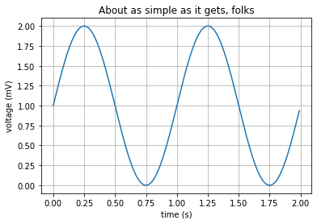

<div markdown="1" class="cell code_cell">
<div class="input_area" markdown="1">
```python
%matplotlib inline
import matplotlib
import matplotlib.pyplot as plt
import numpy as np

# Data for plotting
t = np.arange(0.0, 2.0, 0.01)
s = 1 + np.sin(2 * np.pi * t)

fig, ax = plt.subplots()
ax.plot(t, s)

ax.set(xlabel='time (s)', ylabel='voltage (mV)',
        title='About as simple as it gets, folks')
ax.grid()

fig.savefig("example.png")
plt.show()


```
</div>

<div class="output_wrapper" markdown="1">
<div class="output_subarea" markdown="1">

{:.output_png}


</div>
</div>
</div>

